# Talbe of Content

1. [Technical Documentation](#1.-Technical-Documentation)
    - [Developer Tools and Decorator Class](#Developer-Tools-and-Decorator-Class)
    - [Database-Schema](#Database-Schema)
    - [Used Pattern for app structure](#Used-Pattern-for-app-structure)
    - [Design Decisions](#Design-Decisions)
    - [API Access Points](#API-Access-Points)
    - [Outlook](#Outlook)
2. [Setting up the project](#3.-Setting-up-the-project)
3. [Instruction for use of website](#2.-Instruction-for-use-of-website)
    - [Registration](#Registration)
    - [Login](#Login)
    - [Logout](#Logout) 
    - [Submitting a paper](#Submitting-a-paper)
    - [Paper list/detail/edit](#Paper-list/detail/edit)
        - [List of all paper](#list-of-all-paper)
        - [Paper detail view](#paper-detail-view)
        - [Paper edit](#paper-edit)
    - [User overview page & review](#user-overview-page-and-review)
        - [User overview page](#user-overview-page)
        - [Submitted paper](#submitted-paper)
        - [Papers to review](#papers-to-review)
        - [Review a paper](#review-a-paper)
    - [Conference Chair](#Conference-chair)
        - [List of paper](#list-of-paper)
        - [Work view for the conference chair](#work-view-for-the-conference-chair)
4. [Early on Sketch](#Early-on-sketch)

# 1. Technical Documentation 

This Project was Developed as a part of a Univeristy exercise and is a platform to publish, rate and validate papers.
It was developed in Python Flask only and does not contain any additional libaries.

## Developer Tools and Decorator Class
* Developer-Tool: url_for, was created to make it possible to get around the caching of the browsers
* It is mainly meant for development purposes since it makes it easier to debug and test css styling on the fly.
* The decorator class: decorator, brings functionality such as login_required and requires_roles.
* Makes authentication and authorization requirements for parts of the application much easier to check and request and handle.

## Database-Schema 
The database-schema on which this application was developed of, constists of five tables: 'users', 'papers', 'reviews', 'authors' and 'roles'.
You can see the relational quantities and the contents of the tables in the detailed uml-diagram above.

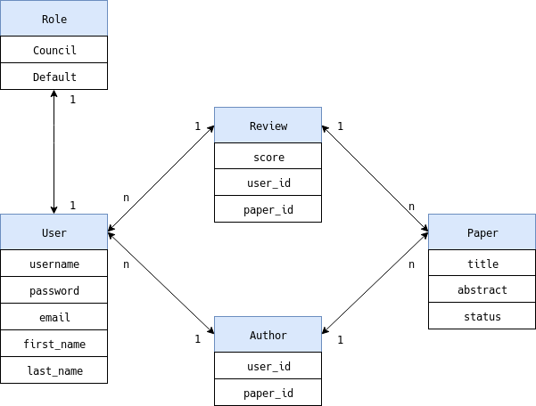

Once the schema was set it was pretty straight forward to setup the Models. The reason we decided to seperate the Author and Review tables, was to simplify the relations between the user and paper to the review and author. This way it made it is easier to use and manage the relations since additional information could be stored in either table if required.
</br>

## Used Pattern for app structure
We went the with Model-View-Control(MVC) pattern for this application.

* Model
    * Our models are the database representations of the tables.
    * To improve performance minor tweaks could have been done to the paper model
    * Functionality such as get status and get score should be extracted to the controllers to increase overall performance
* Control
    * The main controller is the views.py
        * Redirect requests are handeled
        * Form requests are processed and converted
        * Responsible to process every incomming query, request and only return transformed data to the view
        * the business logic is wrapped in controllers, such as user_controller, paper_controller and role_controller. These were written to abstract functionality (split of concerns) and handle database specific queries from the views.py
* View
    * The views are the flasks-jinja2 templates which display the data delived by the controllers, which get rendered through flasks render_template method

## Design Decisions
The whole design of the pages was done with pure css and supports mobile usage, but are not meant for mobile usage.

We focused strongly on the aspect of reusablity of css and html code through inheritance of flasks-jinja2 templates

## API Access Points

1. Url to request a singup

       @app.route('/signup', methods=['GET', 'POST'])

2. Url to request a signin
        
       @app.route('/signin', methods=['GET', 'POST'])

3. Url to request a signout and cleanup of user specific information    

       @app.route('/signout')
    
4. Root url to display user specif information like, his submitted paper or papers he has to review

       @app.route('/')

5. Url to request the form to submit a paper

       @app.route('/submission')

6. Getter url for all papers in the application

       @app.route('/paper')

7. Post url to validate the form passed by the ```/submission``` and store it in the Database

       @app.route('/paper/create', methods=['POST'])

8. Url to request a specifc paper for edit

       @app.route('/paper/<int:paper_id>/edit', methods=['POST', 'GET'])

    * only if the requester is registered as and author
    * Stores it back into the database on submit
    
9. Read-only url for a single paper
    
       @app.route('/paper/<int:paper_id>/', methods=['GET'])

10. Administration page for user-roles, Admin only
        
        @app.route('/admin', methods=['GET'])

11. Post url to store the form information of the ```/admin``` page into the Database

        @app.route('/admin/set-role', methods=['POST'])
    
    * only accessible by admin

12. Url for a specif review

        @app.route('/paper/<int:paper_id>/review', methods=['POST', 'GET'])
    
    * Able to give a score and store it in the review

13. Url to get all the papers submitted by the authenticated user
    
        @app.route('/authored', methods=['GET'])

14. Url to get all the papers assigned for review to the current user
        
        @app.route('/to_review', methods=['GET'])

15. Url for the conference chair to admister submitted papers

        @app.route('/conference_chair', methods=['GET'])

16. Url for the conference chair to assign reviewers and set status of the paper itself (accepted, rejected, under review) 
    
        @app.route('/paper/<int:paper_id>/council/edit', methods=['GET', 'POST'])

    * Only read-access to information of the paper (title, abstract, authors)

## Outlook
The current version of the website is just the first step - MVP. There are a lot of points that can be extended to increase the user experience and should be considered in the future.

* Improved ui for mobile
* Extend usablity of the website by working together with the user.
    * example: Select boxes for assigning reviwer, allow double click to assign.
* More validation on all forms and fields
    * example: Minum lenght for title & abstract
* Feedback about wrong input (Currently its mostly the happy path).
* Upload for the file of the paper
    * A way to display the paper on the website
* More concret Role description. 
    * What is a normal user allowed to see & change.
        * Can only create papers for him self?
        * Only the intial creator can add authors and can not be removed?
    * What can the conference chair do? 
        * Creation of paper?
        * Nominate new conference chair member?
* User & Invitation system.
    * User can send invation to co-authors of their paper, that are not yet registred on the page.
    * Profile page of user, where other user can see the papers of them.
    * Profile page with avatar and some comments from the user.

# 3. Setting up the project

download the repository

    git@github.com:SebastianKapunkt/paper-review-platform.git

cd into the project folder

    cd paper-review-platform

install requirements

    pip install -r requirements.txt

set envirement varaible

    export FLASK_APP=app/__init__.py

# 2. Instruction for use of website

## Registration

Information required to create an account:
- a username
- firstname
- lastname
- email
- password

You can find the signup page here or under ```/signup```

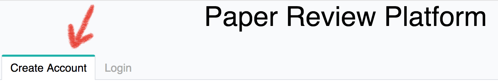

please enter the require information into the form:

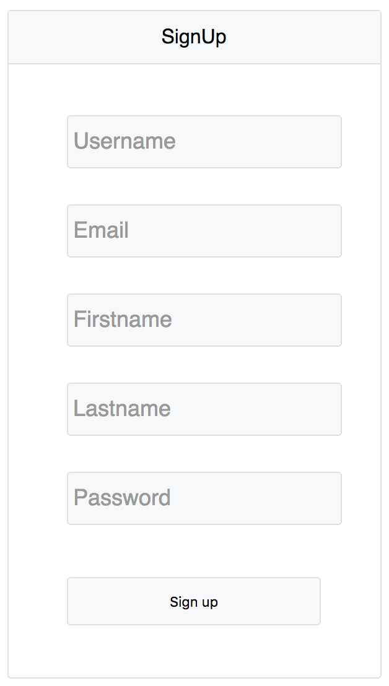

## Login 

To signin you need to enter your e-mail and password. You can find the Login under ```/signin```

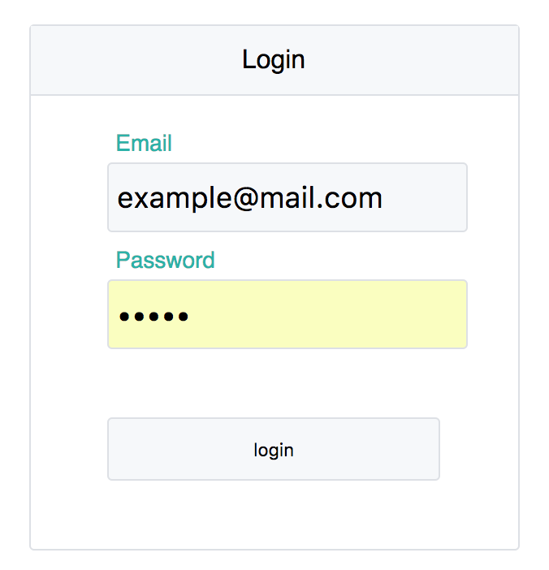

## Logout 

You can find the logout in he top right of the page, in a dropdown by hovering your name. Or go to ```/signout```

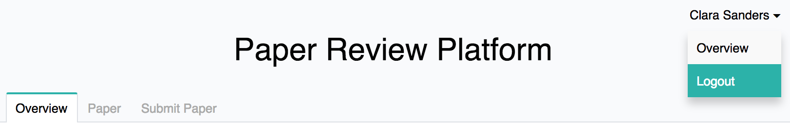

## Submitting a paper

For submitting a paper you go to ```/submission``` or find the tap in the navigation bar:

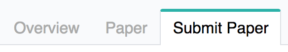

Now you can See the form.
1. Field for the title of the paper.
2. Field for the abstract of the paper.
3. A list of people that can be authors. Note here that if you don't select any author, you will be the author automaticly. To assign someone as a author select a user and press on the button 'Add'(4).
4. Buttons to push items from one box to the other. 'Add' will push selected item from left to right and 'Remove' the other way around.
5. This is the list of selected authors. Only the user in that list will be author, don't forget your self if you are one!
6. Once everything is filled you can submit 'create' the paper.

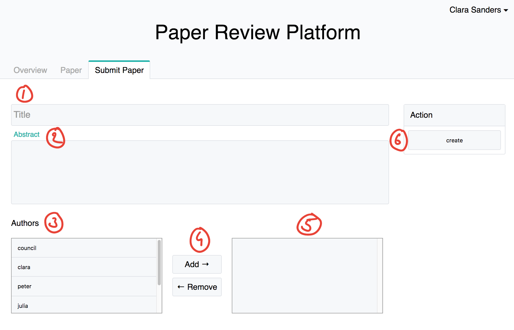

## Paper list/detail/edit
### List of all paper
All papers that were submitted on this plattform are listed here and shown in reveresd chronological order, latest first

The list of paper can be found here: ```/paper``` or in the navigation bar:

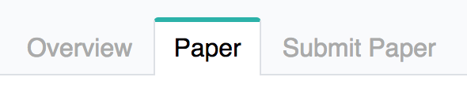

1. Column for title of paper
2. Column for list of authors of that paper
3. Column for status of paper
4. If you click on a row you come to the detail view of a paper

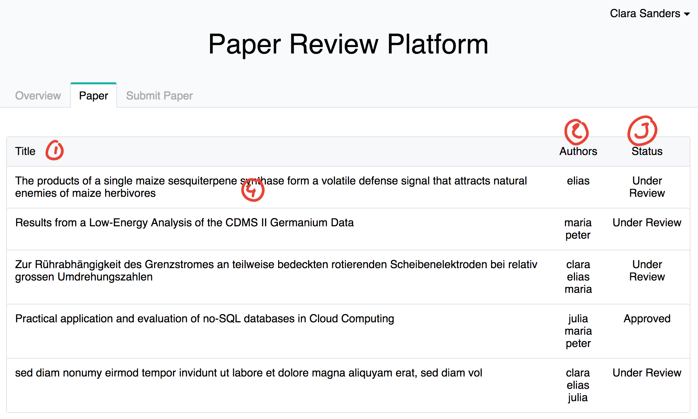

### Paper detail view
In this view you can find all the information that are public, to see for all user.

1. Tiel of the paper.
2. Abstract of the paper.
3. List of the authors.
4. Status of the paper.
5. If you are an author, you can see the edit button and use it to get to the edit view.

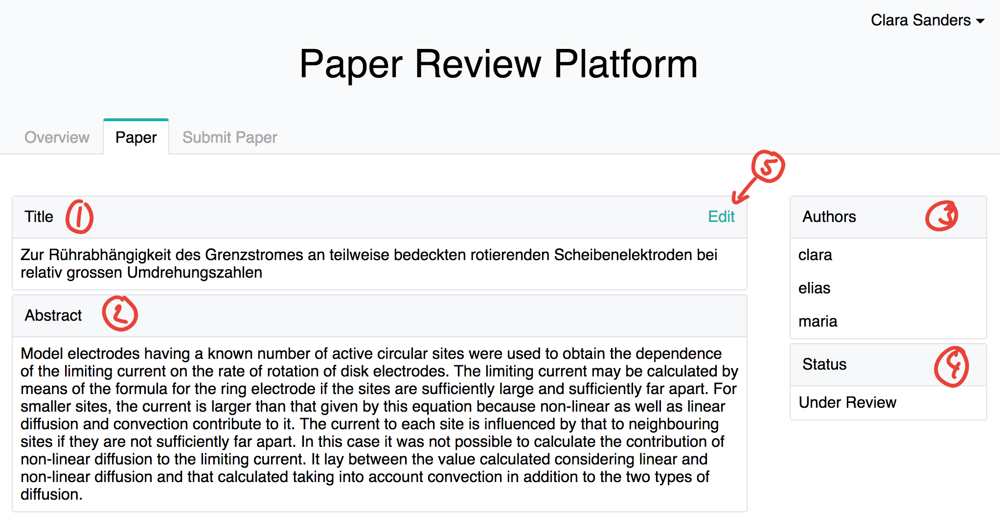

### Paper edit
In this view as an author you can edit your paper information. And also add or remove authors (also your self!)

1. Change title of paper.
2. Change abstract of paper.
3. Add & Remove authors.
4. [Save & continue] -- you save the data you changed and also stay on the page.
5. [Save] -- you save the data you changed and go back to the detail view (As a feature request it can also be the list of papers or the users overview page).
6. [Cancel] -- You don't save any data and just go back to the detail view (Or if requested as a change to another view).
7. Status of the paper

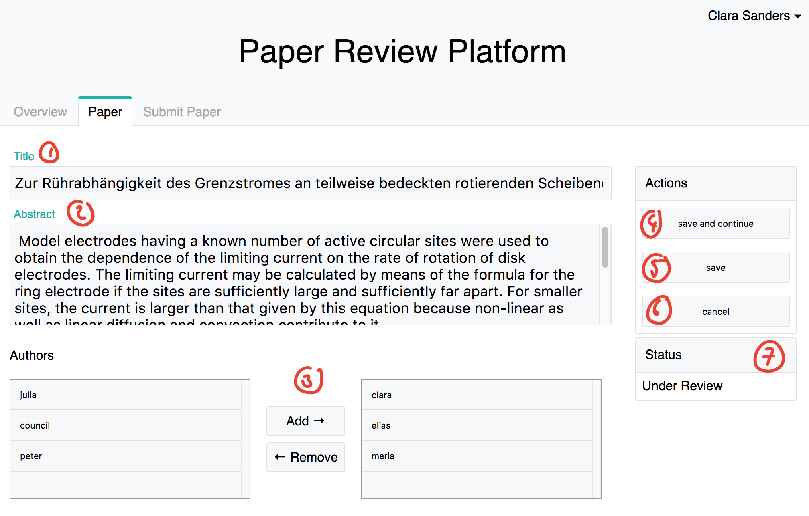


## User overview page and review
### User overview page
This page is the landing and main page for the logged in user (you :) ) You can find it at the root "```/```" or in the navigation bar:

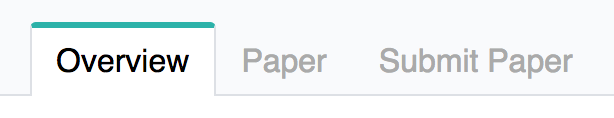

Here you have two 'filter'/main lists of paper
1. [Your submitted papers / where you are author](#submitted-paper)
2. [Papers where you are assigned to review](#papers-to-review)

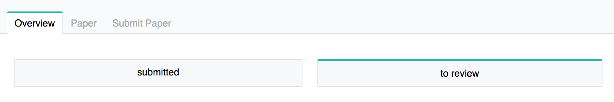

### Submitted paper
This is a list of papers you submitted or you are an author of.

1. Title of the paper.
2. Authors of the paper.
3. Stauts of the paper.
3. If you click on a row you come to the detail view of the paper ([explained here](PAPERS.md)).

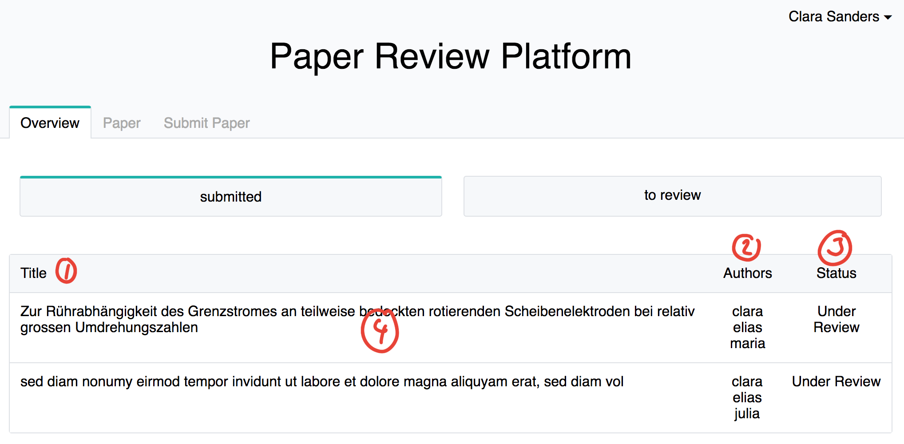

### Papers to review
This is a list of papers where you got requested from the conference chair to review them.

1. Column title of paper.
2. Column authors of paper.
3. Column status of paper.
4. Column of score of your review of that paper. It is None if you haven't reviewed it yet or has the score you have it.
5. If you click on the row you can go to submit or change a review

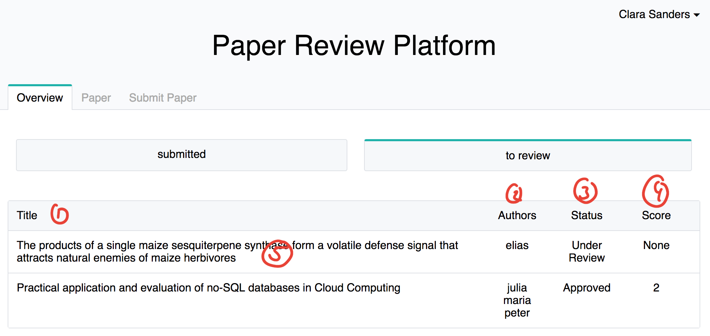

### Review a paper
At this page you can see the papers you were requested to review

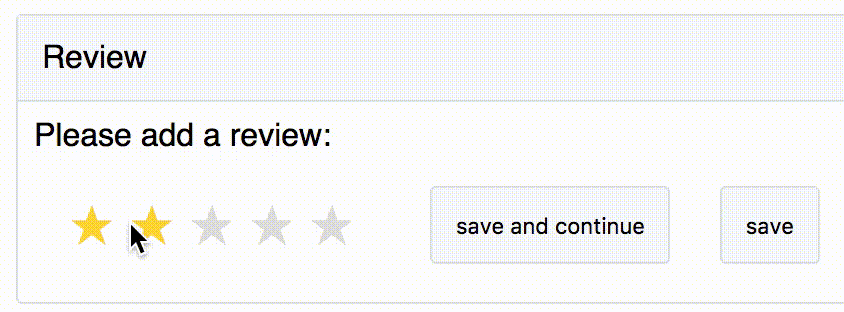

1. represents the rating in stars. 
    - 1 star = -2
    - 2 stars = -1
    - 3 stars = 0
    - 4 stars = 1
    - 5 stars = 2
2. This button will submit your review and you will stay on that page.
3. This button will submit your review and you will be redirected to your overview page
4. The title of the paper to review.
5. The abstract of the paper to review.

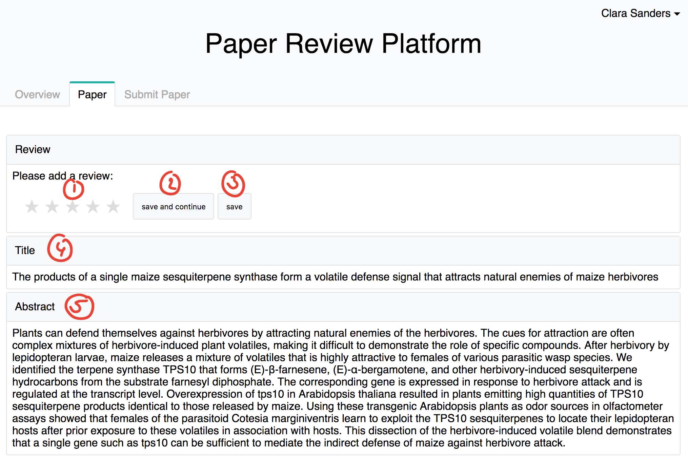

## Conference Chair
If you are a member of this group you will be able to access the 'conference chair' site.
You can find it in the navigation bar:

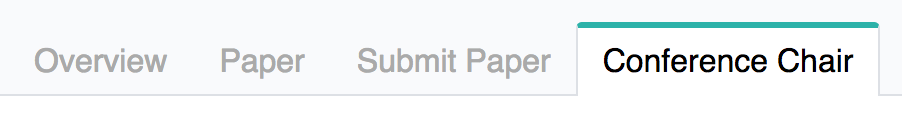

### List of paper
1. Column title of paper.
2. Column reviwer of paper. This are the user that are assigned by the conference chair to review a paper.
3. Column authors of paper.
4. Column status of paper.
5. Column score of review of paper. This is the average over all the scores in reviews given.
6. When you click on a row you will come to the work view for the conference chair of that paper.

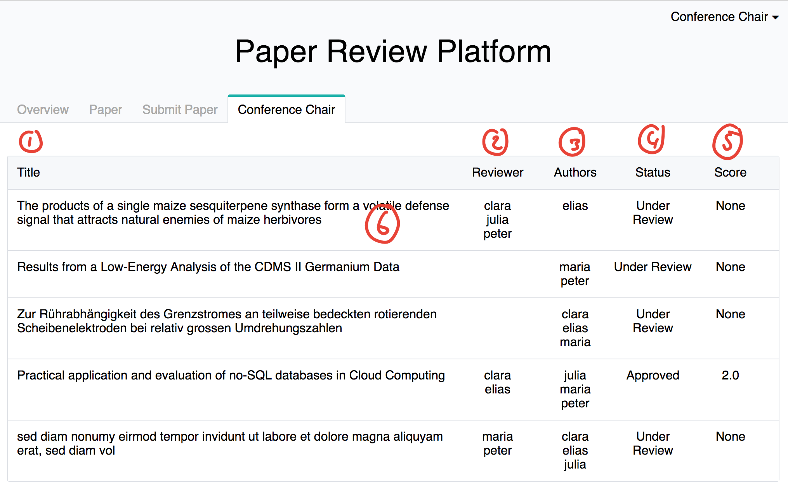

### Work view for the conference chair

1. Title of the paper.
2. Abstract of the paper.
3. Add & Remove reviewer. Note that if you unassign a reviwer the review is gone to, even if you add the reviwer again.
4. Button to set the status 'approve'
5. Button to set the status 'rejected'
6. Button to set the status 'under_review'
7. [save and continue] -- save changes made on the page and stay on the page.
8. [save] -- save changed made and go back to the list of paper (conference chair).
9. [cancel] -- save nothing and go back to list of paper (conference chair).
10. Current status of the paper.
11. Authors of the paper.
12. Reviews of the paper. First row is the average score of the paper over all reviews. The following rows are the individual reviews with their scores.

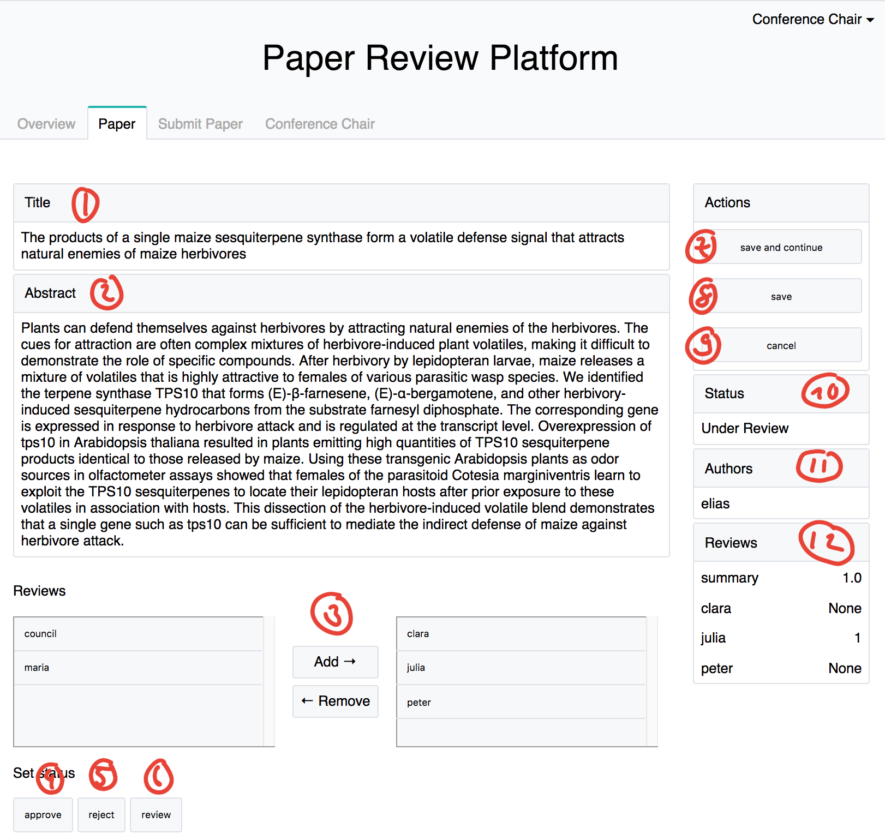

# Early on sketch

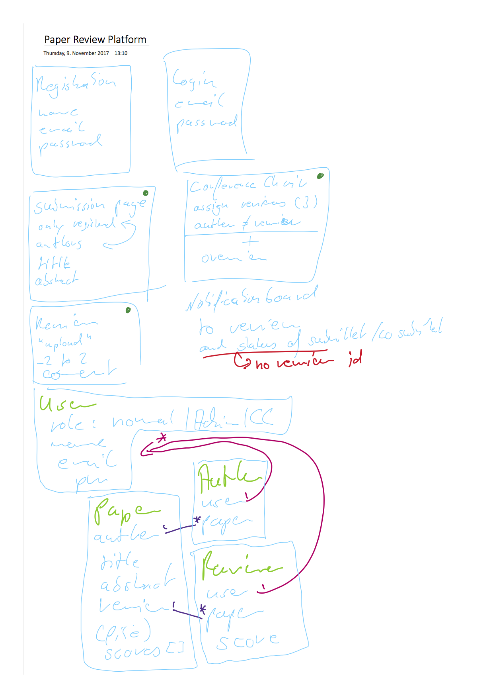
