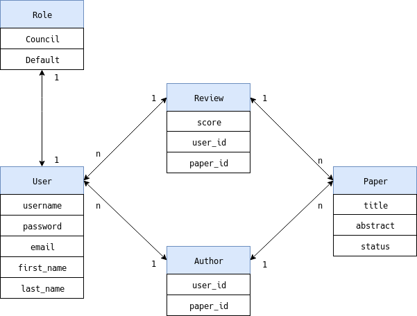

# Documentation 

This Project was Developed as a part of a Univeristy exercise and is a platform to publish, rate and validate papers.
It was developed in Python Flask only and does not contain any additional libaries.

##  Helper and Decorater Class 
* The helper class url_for, was created to make it possible to get around the caching of the browsers. It is mainly meant for development purposes since it makes it easier to debug and test css styling on the fly.
* The decorator class, brings functionality such as login_required and required_role. This makes authentication and authorization requirements for parts of the application much easier.

#  Database-Schema 

The database-schema on which this application was developed of, constists of five tables: 'users', 'papers', 'reviews', 'authors' and 'roles'.
You can see the relational quantities and the contents of the tables in the detailed uml-diagram above.

Once the schema was set it was pretty straight forward to setup the Models. The reason we decided to seperate the Author and Review tables, was to simplify the relations between the user and paper to the review and author. This way it made it is easier to use and manage the relations since additional information could be stored in either table if required.
 

##  Pattern 
We went the with Model-View-Control(MVC) pattern for this application.

* Model
    * Our models are the database representations of the tables.
    * To improve performance minor tweaks could have been done to the paper model since it contains functionality which should be in the controllers, the functions mentioned here are the: get status and get score functions
* Control
    * The main controller is the views.py
        * Redirect requests and general form request are processed here
        * It is responsible to process every incomming query, request and only return processed data to the view
        * Helper controllers such as user_controller, paper_controller and role_controller were written to abstract functionality and handle database specific queries
* View
    * The views are the jinja2 templates which display the data delived by the controllers, which get rendered through flasks render_template method

##  Design 
The whole design of the pages were done manually and support mobile usage, but are not meant for mobile usage.

We focused strongly on the aspect reusablity of css and html code through inheritance of jinja2 templates.

## Outlook
The current version of the website is just the first step - MVP. There are a lot of points that can be extended to increase the user experience and should be considered in the future.

* Improved ui for mobile
* Extend usablity of the website by working together with the user.
    * example: Select boxes for assigning reviwer, allow double click to assign.
* More validation on all forms and fields
    * example: Minum lenght for title & abstract
* Feedback about wrong input (Currently its mostly the happy path).
* Upload for the file of the paper
    * A way to display the paper on the website
* More concret Role description. 
    * What is a normal user allowed to see & change.
        * Can only create papers for him self?
        * Only the intial creator can add authors and can not be removed?
    * What can the conference chair do? 
        * Creation of paper?
        * Nominate new conference chair member?
* User & Invitation system.
    * User can send invation to co-authors of their paper, that are not yet registred on the page.
    * Profile page of user, where other user can see the papers of them.
    * Profile page with avatar and some comments from the user.