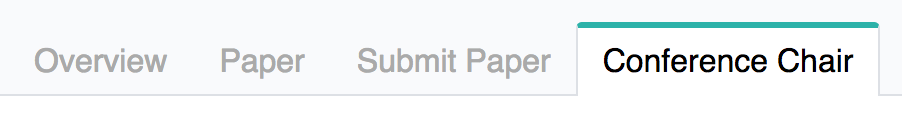
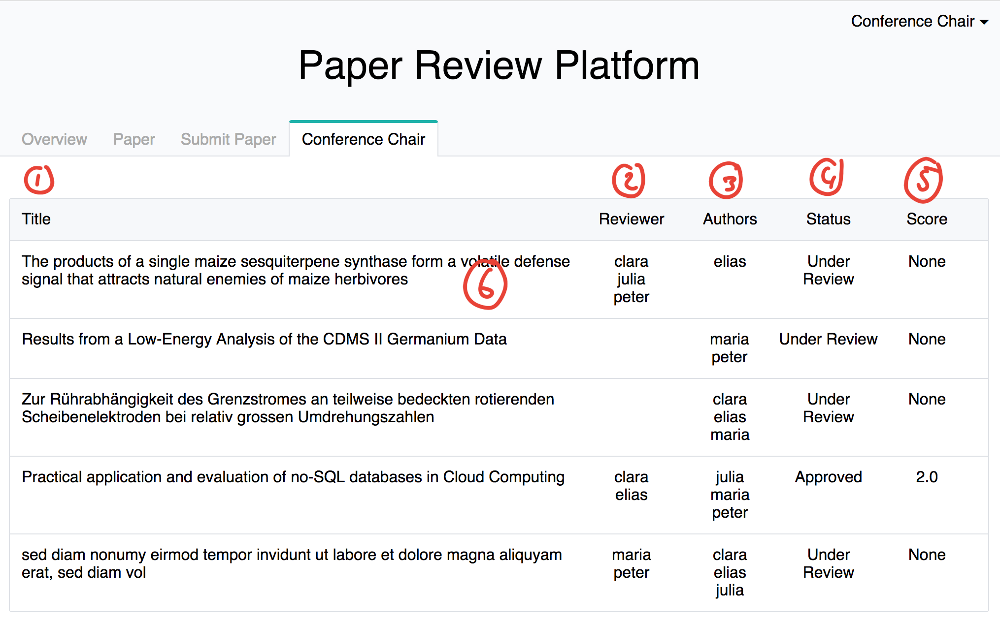
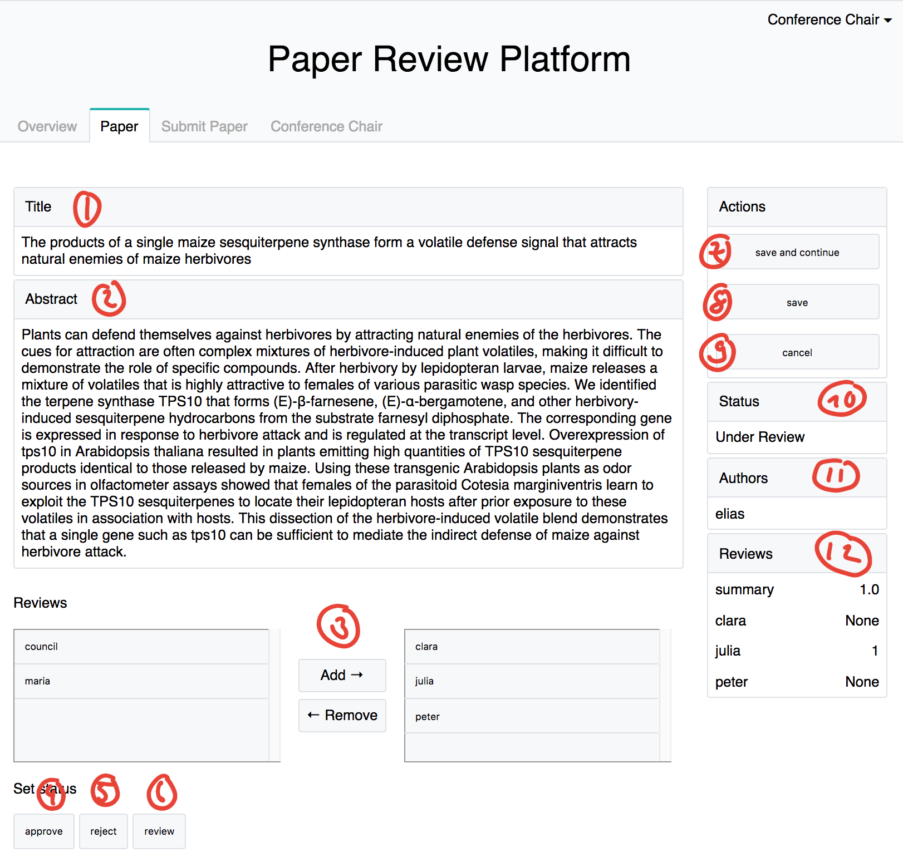

# Content
- [Conference Chair](#conference-chair)
- [List of paper](#list-of-paper)
- [Work view for the conference chair](#work-view-for-the-conference-chair)

# Conference Chair
If you are a member of this group you will be able to access the 'conference chair' site.
You can find it in the navigation bar:

# List of paper
1. Column title of paper.
2. Column reviwer of paper. This are the user that are assigned by the conference chair to review a paper.
3. Column authors of paper.
4. Column status of paper.
5. Column score of review of paper. This is the average over all the scores in reviews given.
6. When you click on a row you will come to the work view for the conference chair of that paper.

# Work view for the conference chair

1. Title of the paper.
2. Abstract of the paper.
3. Add & Remove reviewer. Note that if you unassign a reviwer the review is gone to, even if you add the reviwer again.
4. Button to set the status 'approve'
5. Button to set the status 'rejected'
6. Button to set the status 'under_review'
7. [save and continue] -- save changes made on the page and stay on the page.
8. [save] -- save changed made and go back to the list of paper (conference chair).
9. [cancel] -- save nothing and go back to list of paper (conference chair).
10. Current status of the paper.
11. Authors of the paper.
12. Reviews of the paper. First row is the average score of the paper over all reviews. The following rows are the individual reviews with their scores.

