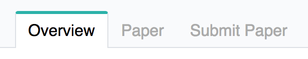
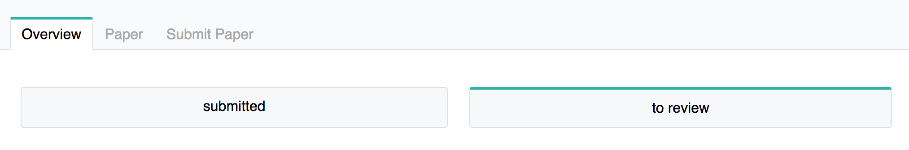
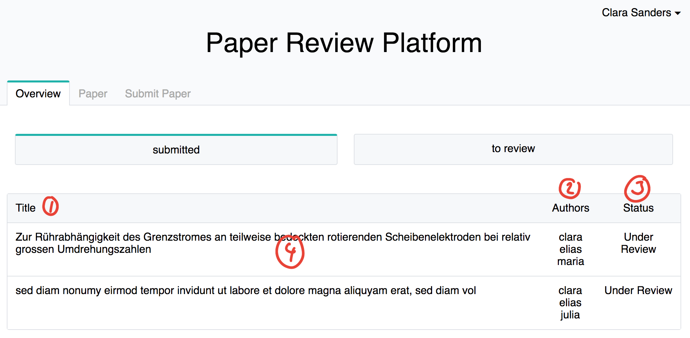
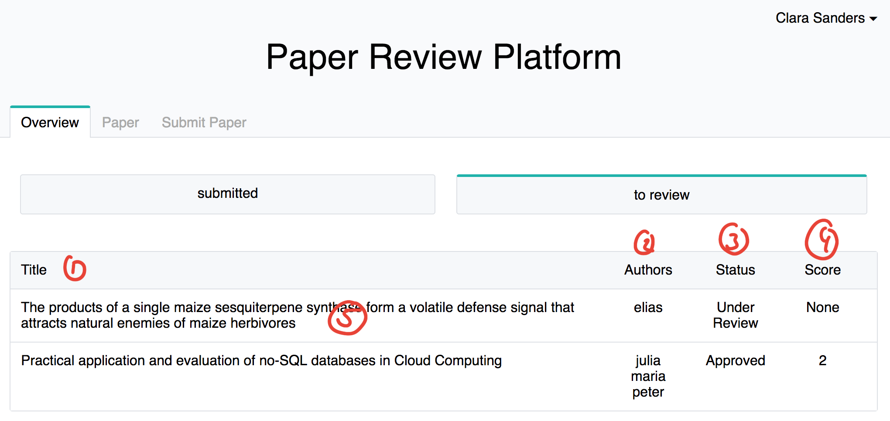
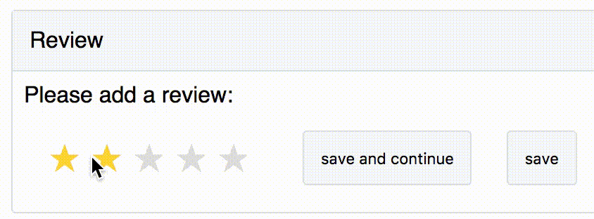
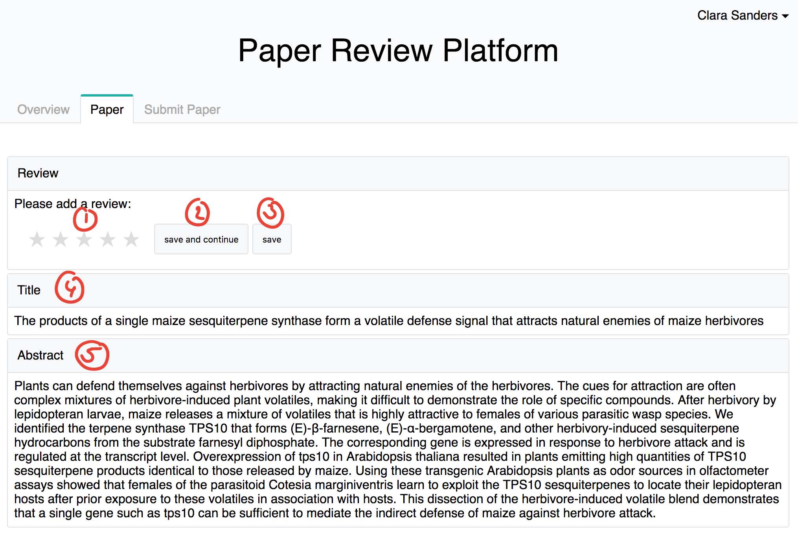

# Content
- [User overview page](#user-overview-page)
- [Submitted paper](#submitted-paper)
- [Papers to review](#papers-to-review)
- [Review a paper](#review-a-paper)

# User overview page
This page is the landing and main page for the logged in user (you :) ) You can find it at the root "```/```" or in the navigation bar:



Here you have two 'filter'/main lists of paper
1. [Your submitted papers / where you are author](#submitted-paper)
2. [Papers where you are assigned to review](#papers-to-review)



## Submitted paper
This is a list of papers you submitted or you are an author of.

1. Title of the paper.
2. Authors of the paper.
3. Stauts of the paper.
3. If you click on a row you come to the detail view of the paper ([explained here](PAPERS.md)).



## Papers to review
This is a list of papers where you got requested from the conference chair to review them.

1. Column title of paper.
2. Column authors of paper.
3. Column status of paper.
4. Column of score of your review of that paper. It is None if you haven't reviewed it yet or has the score you have it.
5. If you click on the row you can go to submit or change a review



## Review a paper
At this page you can see the papers you were requested to review



1. represents the rating in stars. 
    - 1 star = -2
    - 2 stars = -1
    - 3 stars = 0
    - 4 stars = 1
    - 5 stars = 2
2. This button will submit your review and you will stay on that page.
3. This button will submit your review and you will be redirected to your overview page
4. The title of the paper to review.
5. The abstract of the paper to review.


