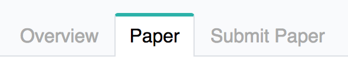
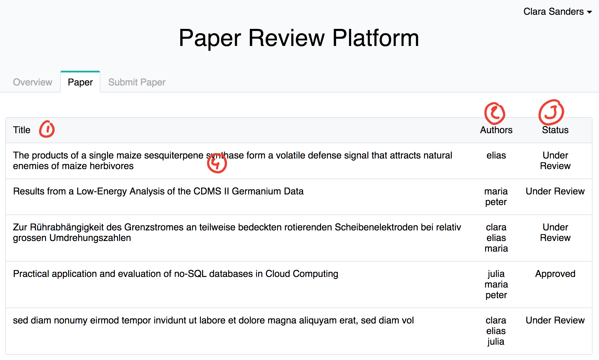
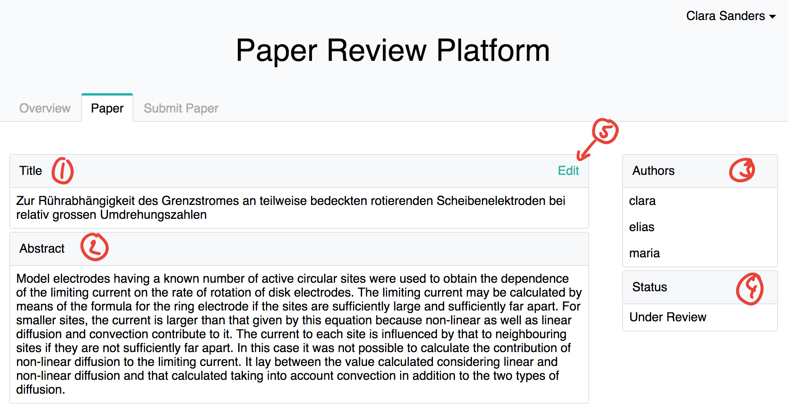
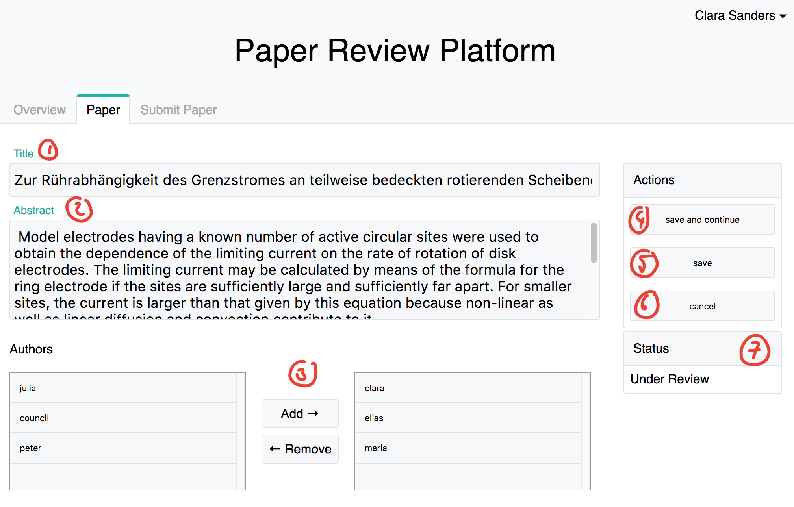

# Content
- [List of all paper](#list-of-all-paper)
- [Paper detail view](#paper-detail-view)
- [Paper edit](#paper-edit)

# List of all paper
All papers that were submitted on this plattform are listed here and shown in reveresd chronological order, latest first

The list of paper can be found here: ```/paper``` or in the navigation bar:



1. Column for title of paper
2. Column for list of authors of that paper
3. Column for status of paper
4. If you click on a row you come to the detail view of a paper



# Paper detail view
In this view you can find all the information that are public, to see for all user.

1. Tiel of the paper.
2. Abstract of the paper.
3. List of the authors.
4. Status of the paper.
5. If you are an author, you can see the edit button and use it to get to the edit view.



# Paper edit
In this view as an author you can edit your paper information. And also add or remove authors (also your self!)

1. Change title of paper.
2. Change abstract of paper.
3. Add & Remove authors.
4. [Save & continue] -- you save the data you changed and also stay on the page.
5. [Save] -- you save the data you changed and go back to the detail view (As a feature request it can also be the list of papers or the users overview page).
6. [Cancel] -- You don't save any data and just go back to the detail view (Or if requested as a change to another view).
7. Status of the paper

