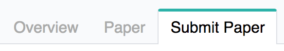
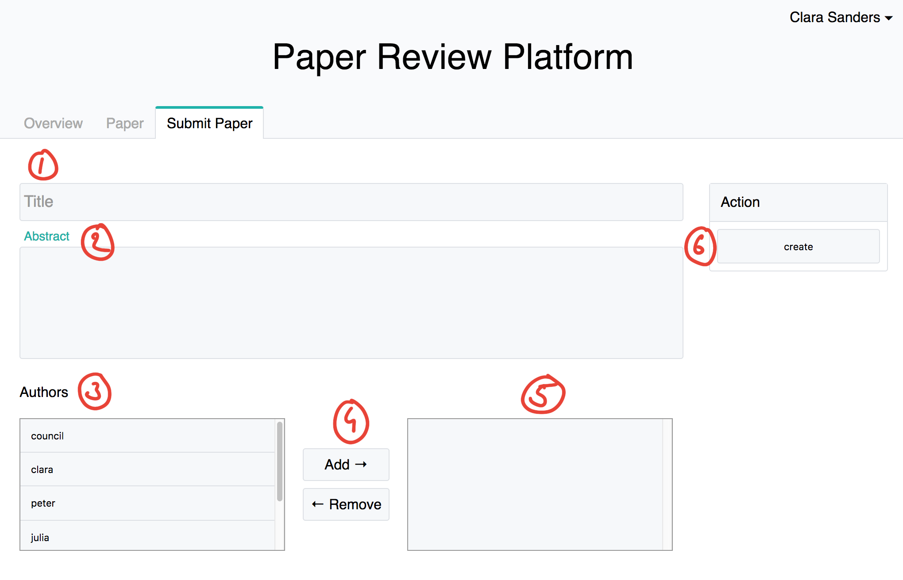

# Content
- [Submitting a paper](#submitting-a-paper)

# Submitting a paper

For submitting a paper you go to ```/submission``` or find the tap in the navigation bar:



Now you can See the form.
1. Field for the title of the paper.
2. Field for the abstract of the paper.
3. A list of people that can be authors. Note here that if you don't select any author, you will be the author automaticly. To assign someone as a author select a user and press on the button 'Add'(4).
4. Buttons to push items from one box to the other. 'Add' will push selected item from left to right and 'Remove' the other way around.
5. This is the list of selected authors. Only the user in that list will be author, don't forget your self if you are one!
6. Once everything is filled you can submit 'create' the paper.

